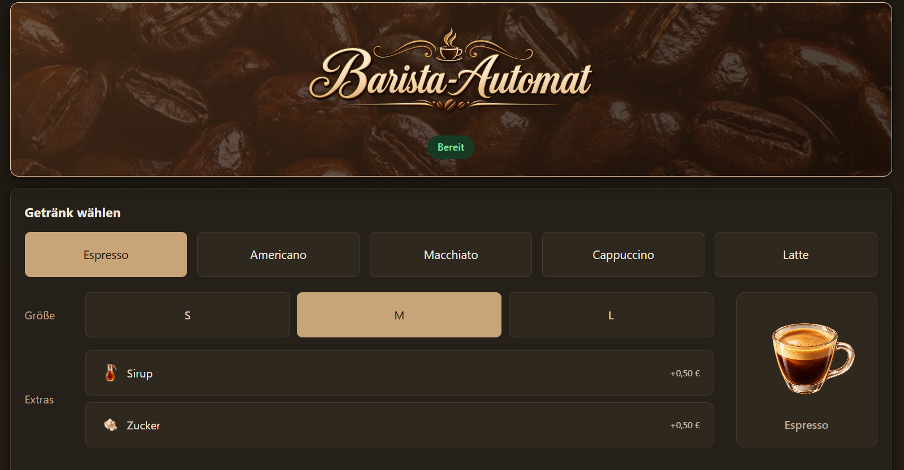

# kaffee-in-production ☕



Ein kleiner Barista-Automat als zwei Versionen: einmal aus dem Unterricht, einmal als
Weiterführung, bei der ich als Product Owner mit [Claude](https://claude.ai) als Entwickler
zusammengearbeitet habe. Der eigentliche Showcase hier ist weniger die App selbst als der
**Prozess dahinter**: wie ich Anforderungen formuliert, Entscheidungen getroffen, getestet und
KI als Entwicklungswerkzeug gezielt eingesetzt habe.

## Warum dieses Projekt?

Die `unterrichtsversion/` ist im FIAE-Unterricht entstanden. Statt sie einfach so stehen zu
lassen, wollte ich sie außerhalb des Unterrichts als eigenes kleines Projekt weiterdenken, mit
zwei konkreten Zielen: erstens bewusst mit Technologien arbeiten, die ich vorher noch nicht
genutzt hatte (React, TypeScript, Vite), und zweitens gezielt üben, wie man mit einem
KI-Tool wie Claude als Entwicklungswerkzeug zusammenarbeitet, statt es nur mal ausprobiert zu
haben. Die App selbst ist bewusst überschaubar geblieben. Der Punkt war nicht "möglichst viel
Software", sondern der Umgang mit Anforderungen, Entscheidungen und KI-Zusammenarbeit an einem
kleinen, gut überschaubaren Beispiel.

## Mein Vorgehen

Bevor der eigentliche Dialog mit Claude begann, habe ich meine Unterrichtsunterlagen zu
Anforderungen und Fehlerfällen gesichtet und mit Unterstützung eines weiteren KI-Tools sortiert.
Von dort aus ging es mehrstufig weiter: erweitern, auf Sinnhaftigkeit prüfen, bis daraus der
Eingangsprompt entstand, mit dem ich das Gespräch mit Claude eröffnet habe.

Die rundenbasierte Zusammenarbeit setzte erst nach dieser eigenen Vorklärung ein: Für jede
Produktentscheidung (Getränkeauswahl, Größensystem, Zustände, Fehlerverhalten, Layout, ...) hat
Claude mir 2–4 realistische Optionen mit Vor-/Nachteilen vorgeschlagen. Ich habe entschieden und
begründet, das Ergebnis wurde protokolliert, danach erst umgesetzt, nicht andersherum. Nach der
Umsetzung wurde getestet, Grenzfälle wurden gesammelt, und aufgetretene Probleme (z. B. dass der
Fehler-Zustand ursprünglich die ganze Maschine statt nur betroffene Getränke sperrte) flossen als
neue Entscheidungsrunde zurück in den Prozess. Nachlesbar in
[`ENTSCHEIDUNGSPROTOKOLL.md`](./ENTSCHEIDUNGSPROTOKOLL.md).

## Was ich dabei gelernt habe

Die Entscheidung, in diesem Projekt bewusst mit mir bis dahin unbekannten Sprachen zu arbeiten,
war kein Zufall. Ich wollte herausfinden, wie weit ich komme, ohne den erzeugten Code wirklich zu
verstehen, und wo die Grenzen dieses Vorgehens liegen, auch bei sorgfältiger Vorarbeit in
Anforderungen und Entscheidungen.

Bei der Entwicklung dieses Projekts habe ich gemerkt, dass mir aktuell besonders die
**Erarbeitung und Strukturierung der Anforderungen** liegt. Zu klären, was eine Lösung leisten
soll, welche Abläufe notwendig sind und wie sich diese Anforderungen präzise beschreiben lassen,
fällt mir derzeit deutlich leichter als die eigentliche Programmierung. Ein Beispiel dafür ist der
Fehler-Zustand des Automaten: In der ersten Umsetzung sperrte ein fehlender Vorrat die gesamte
Maschine für alle Getränke. Beim Testen fiel mir auf, dass zum Beispiel der Americano auch ohne
Milch zubereitet werden kann und trotzdem gesperrt war. Diese Beobachtung in eine klare
Anforderung zu übersetzen, die Sperre pro Getränk statt maschinenweit zu regeln, war eine leichte
Aufgabe verglichen mit der codetechnischen Umsetzung in einer mir bisher nicht geläufigen Sprache.

Ein funktionsfähiges Ergebnis bedeutet nicht, dass ich auch den zugrunde liegenden Code verstanden
habe. KI kann Code erzeugen, den ich auf meinem aktuellen Kenntnisstand noch nicht selbstständig
hätte schreiben können. Dadurch besteht die Gefahr, die eigenen Programmierkenntnisse zu
überschätzen. Der Unterschied zwischen dem, was ich **mit Unterstützung umsetzen kann**, und dem,
was ich bereits **selbstständig verstehe und entwickeln könnte**, ist mir durch das Projekt
deutlich bewusster geworden.

Besonders gut funktioniert für mich ein **schrittweiser, dialogischer Entwicklungsprozess**. Statt
eine vollständige Lösung einmalig beschreiben und generieren zu lassen, arbeite ich Anforderungen
und Änderungen nacheinander heraus. Der Austausch mit der KI ähnelt dabei einem Dialog mit einem
Kommilitonen und Dozenten zugleich: Lösungswege werden besprochen, Rückfragen entstehen und
Vorschläge werden angepasst oder verworfen.

Meine bisherige Erfahrung ist, dass KI die technische Einstiegshürde senkt und es ermöglicht,
schneller funktionsfähige Software zu entwickeln. Für mich rücken dabei besonders das **Verstehen
und Strukturieren von Anforderungen, ihre präzise sprachliche Beschreibung sowie die Beurteilung
vorgeschlagener Lösungen** in den Vordergrund. Das setzt gleichzeitig voraus, dass die zugrunde
liegenden fachlichen und programmiertechnischen Grundlagen ausreichend verstanden sind, um
Anforderungen präzise formulieren und vorgeschlagene Lösungen sinnvoll beurteilen zu können.

Für meine weitere Entwicklung bedeutet das, KI bewusst als Unterstützung einzusetzen und
gleichzeitig darauf zu achten, dass sich die Programmiergrundlagen durch praktische Anwendung
festigen und das eigenständige Schreiben und Entwickeln von Code nicht zu kurz kommt.

## Ehrlich gesagt: wer hat was gemacht?

- **Ich:** Anforderungen, Produktentscheidungen (Getränke, Preise, Fehlerverhalten, Layout, ...),
  Priorisierung, Testen der Ergebnisse, Feedback und Änderungswünsche.
- **Claude:** Technische Umsetzung basierend auf meinen Entscheidungen: Code, Komponentenstruktur,
  Implementierungsvorschläge.

Ich habe **nicht** den gesamten Code allein geschrieben. React, TypeScript und Vite waren für mich
vor diesem Projekt komplett neu. Das war bewusst so gewählt, um zu zeigen, wie ich mich mit
KI-Unterstützung gezielt in unbekanntes technisches Terrain vorwage, nicht um vorzutäuschen, ich
sei darin bereits erfahren.

## Zwei Versionen

| | `unterrichtsversion/` | `showcase/` |
|---|---|---|
| Entstanden | im Unterricht | danach, in Eigeninitiative |
| Tech-Stack | Vanilla JS/CSS/HTML | React + TypeScript + Vite |
| Autor:in | ich, allein | ich (Anforderungen/Entscheidungen/Tests) + Claude (Umsetzung) |
| Status | unverändert als Referenz | aktiv erweitert |

Die fachliche Grundlage (Zustandsmaschine, Getränke, Preisberechnung, Fehlerlogik) ist in beiden
Versionen identisch, nur die technische Umsetzung unterscheidet sich.

## Die eigentlichen Beweisstücke

Der Code allein zeigt nicht, wie er entstanden ist. Interessanter sind:

- [`ENTSCHEIDUNGSPROTOKOLL.md`](./ENTSCHEIDUNGSPROTOKOLL.md): dokumentiert jede
  Produktentscheidung, welche Optionen zur Debatte standen, was entschieden wurde, warum, und was
  danach beim Testen herauskam.
- [`showcase/GRENZFAELLE_UND_TESTIDEEN.md`](./showcase/GRENZFAELLE_UND_TESTIDEEN.md): Grenzfälle
  und Testideen, die während der Entwicklung aufgefallen sind.

## Ausprobieren

```bash
cd showcase
npm install
npm run dev
```

Tests laufen mit `npm test`, Linting mit `npm run lint`, Produktions-Build mit `npm run build`
(alles innerhalb von `showcase/`). Ein GitHub-Actions-Workflow prüft das bei jedem Push automatisch
(siehe [`.github/workflows/ci.yml`](./.github/workflows/ci.yml)).

Die `unterrichtsversion/` braucht keine Installation, einfach `index.html` direkt im Browser
öffnen.

## Lizenz

MIT, siehe [`LICENSE`](./LICENSE).
